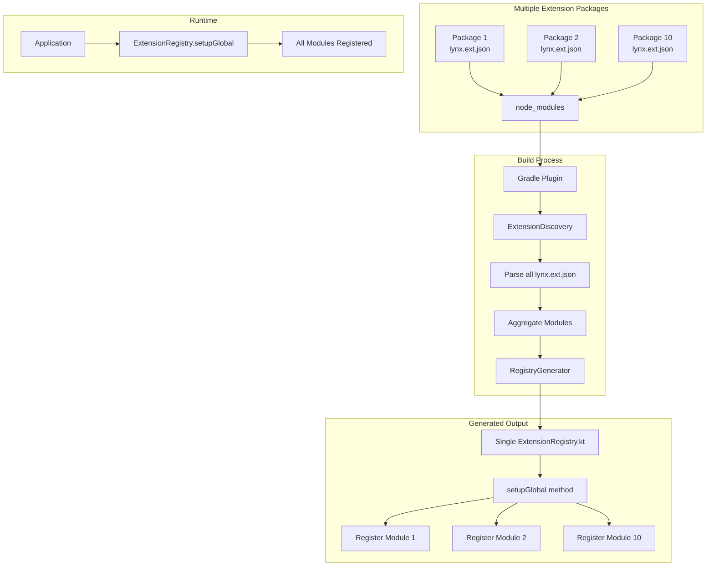
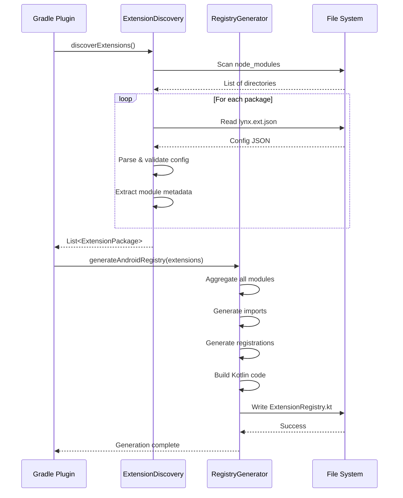

# Design Document

## Overview

This design extends the existing LynxJS Autolink system to support Java source files alongside Kotlin and ensures a single unified registry handles all native modules from multiple extension packages. The solution builds upon the current implementation in `src/autolink/` and `plugins/gradle-autolink-plugin/` to provide robust multi-package support and Java/Kotlin interoperability.

The key insight is that we already have the infrastructure - we just need to enhance the configuration format and registry generation to handle Java classes and properly aggregate modules from multiple packages.

## Architecture

### High-Level Architecture



### Current vs Enhanced Flow

**Current State:**

- ✅ Discovery scans node_modules for lynx.ext.json
- ✅ Generates single ExtensionRegistry.kt
- ⚠️ Assumes Kotlin-only modules
- ⚠️ Uses simple string arrays for module names

**Enhanced State:**

- ✅ Discovery scans node_modules for lynx.ext.json
- ✅ Generates single ExtensionRegistry.kt
- ✅ Supports both Java and Kotlin modules
- ✅ Uses structured module metadata with className

## Components and Interfaces

### 1. Enhanced lynx.ext.json Configuration

**Current Format:**

```json
{
  "name": "@lynxjs/local-storage",
  "version": "1.0.0",
  "platforms": {
    "android": {
      "packageName": "com.lynxjs.localstorage"
    }
  },
  "nativeModules": ["LocalStorageModule"],
  "elements": [],
  "services": []
}
```

**Enhanced Format:**

```json
{
  "name": "@lynxjs/local-storage",
  "version": "1.0.0",
  "platforms": {
    "android": {
      "packageName": "com.lynxjs.localstorage",
      "sourceDir": "android/src/main",
      "language": "kotlin"
    }
  },
  "nativeModules": [
    {
      "name": "LocalStorage",
      "className": "LocalStorageModule",
      "language": "kotlin"
    }
  ],
  "elements": [],
  "services": []
}
```

**For Java Modules:**

```json
{
  "name": "@lynxjs/camera",
  "version": "1.0.0",
  "platforms": {
    "android": {
      "packageName": "com.lynxjs.camera",
      "sourceDir": "android/src/main",
      "language": "java"
    }
  },
  "nativeModules": [
    {
      "name": "Camera",
      "className": "CameraModule",
      "language": "java"
    }
  ]
}
```

### 2. Enhanced AutolinkConfig Data Model

**Kotlin Data Classes:**

```kotlin
data class AutolinkConfig(
    val name: String,
    val version: String,
    val platforms: Platforms,
    val nativeModules: List<NativeModuleConfig> = emptyList(),
    val elements: List<ElementConfig> = emptyList(),
    val services: List<ServiceConfig> = emptyList()
)

data class Platforms(
    val android: AndroidConfig? = null,
    val ios: IOSConfig? = null,
    val web: WebConfig? = null
)

data class AndroidConfig(
    val packageName: String,
    val sourceDir: String = "android/src/main",
    val language: String = "kotlin", // "kotlin" or "java"
    val buildTypes: List<String> = listOf("debug", "release")
)

data class NativeModuleConfig(
    val name: String,           // Registration name (e.g., "LocalStorage")
    val className: String,      // Class name (e.g., "LocalStorageModule")
    val language: String = "kotlin"  // "kotlin" or "java"
)

data class ElementConfig(
    val name: String,           // Tag name (e.g., "custom-button")
    val className: String,      // Class name (e.g., "CustomButton")
    val language: String = "kotlin"
)

data class ServiceConfig(
    val name: String,
    val className: String,
    val language: String = "kotlin"
)
```

### 3. Enhanced Registry Generator

**Key Changes:**

1. Generate fully qualified class names for imports
2. Handle both Java and Kotlin class instantiation
3. Aggregate modules from all discovered packages
4. Add proper error handling and logging

**Generated Registry Example:**

```kotlin
package com.lynx.autolink.generated

import android.content.Context
import com.lynx.tasm.LynxEnv
import com.lynx.tasm.behavior.Behavior
import com.lynx.tasm.behavior.LynxContext

// Native Modules from @lynxjs/local-storage
import com.lynxjs.localstorage.LocalStorageModule

// Native Modules from @lynxjs/camera
import com.lynxjs.camera.CameraModule

// Native Modules from @lynxjs/geolocation
import com.lynxjs.geolocation.GeolocationModule

/**
 * Auto-generated registry for Lynx extensions
 * Generated by Lynx Autolink Gradle Plugin v0.0.1
 *
 * This file is automatically generated. Do not edit manually.
 *
 * Discovered extensions:
 *   - @lynxjs/local-storage@1.0.0
 *   - @lynxjs/camera@1.2.0
 *   - @lynxjs/geolocation@2.0.1
 */
object ExtensionRegistry {

    /**
     * Registers all discovered Lynx extensions with the application
     * Call this method in your Application.onCreate() or Activity.onCreate()
     *
     * @param context Android application context
     */
    fun setupGlobal(context: Context) {
        // Register native modules using LynxEnv.inst().registerModule()

        // From @lynxjs/local-storage
        try {
            LynxEnv.inst().registerModule("LocalStorage", LocalStorageModule::class.java)
            android.util.Log.d("ExtensionRegistry", "Registered module: LocalStorage")
        } catch (e: Exception) {
            android.util.Log.e("ExtensionRegistry", "Failed to register module LocalStorage: ${e.message}")
        }

        // From @lynxjs/camera
        try {
            LynxEnv.inst().registerModule("Camera", CameraModule::class.java)
            android.util.Log.d("ExtensionRegistry", "Registered module: Camera")
        } catch (e: Exception) {
            android.util.Log.e("ExtensionRegistry", "Failed to register module Camera: ${e.message}")
        }

        // From @lynxjs/geolocation
        try {
            LynxEnv.inst().registerModule("Geolocation", GeolocationModule::class.java)
            android.util.Log.d("ExtensionRegistry", "Registered module: Geolocation")
        } catch (e: Exception) {
            android.util.Log.e("ExtensionRegistry", "Failed to register module Geolocation: ${e.message}")
        }
    }
}
```

### 4. Enhanced CLI Tool

**Update `lynxjs-module init` command:**

```typescript
// Generate lynx.ext.json with structured module config
const lynxExtConfig = {
  name: packageName,
  version: "1.0.0",
  platforms: {
    android: {
      packageName: androidPackageName,
      sourceDir: "android/src/main",
      language: "kotlin", // or "java" based on user choice
    },
    ios: {
      sourceDir: "ios/src",
    },
  },
  nativeModules: [
    {
      name: moduleName,
      className: `${moduleName}Module`,
      language: "kotlin", // or "java"
    },
  ],
  elements: [],
  services: [],
};
```

## Data Models

### Extension Package Structure

```
@lynxjs/extension-name/
├── lynx.ext.json              # Enhanced configuration
├── package.json
├── src/                       # TypeScript source
│   ├── index.ts
│   └── module.ts
├── android/                   # Android implementation
│   └── src/main/
│       ├── kotlin/           # Kotlin sources
│       │   └── com/lynxjs/extension/
│       │       └── ExtensionModule.kt
│       └── java/             # Java sources
│           └── com/lynxjs/extension/
│               └── ExtensionModule.java
└── ios/                       # iOS implementation
    └── src/
```

### Registry Generation Data Flow



## Error Handling

### Configuration Validation

**Missing Required Fields:**

```kotlin
if (config.platforms.android == null) {
    throw GradleException(
        "Extension ${config.name} is missing Android platform configuration. " +
        "Add 'platforms.android' to lynx.ext.json"
    )
}

if (config.platforms.android.packageName.isEmpty()) {
    throw GradleException(
        "Extension ${config.name} has empty Android packageName. " +
        "Set 'platforms.android.packageName' in lynx.ext.json"
    )
}
```

**Invalid Module Configuration:**

```kotlin
config.nativeModules.forEach { module ->
    if (module.name.isEmpty()) {
        throw GradleException(
            "Extension ${config.name} has a module with empty name. " +
            "Each module must have a 'name' field"
        )
    }

    if (module.className.isEmpty()) {
        throw GradleException(
            "Extension ${config.name} module '${module.name}' has empty className. " +
            "Each module must have a 'className' field"
        )
    }

    if (module.language !in listOf("kotlin", "java")) {
        println("⚠️  Warning: Module ${module.name} has unknown language '${module.language}', defaulting to 'kotlin'")
    }
}
```

### Runtime Registration Errors

**Module Registration Failure:**

```kotlin
try {
    LynxEnv.inst().registerModule("LocalStorage", LocalStorageModule::class.java)
    android.util.Log.d("ExtensionRegistry", "Registered module: LocalStorage")
} catch (e: ClassNotFoundException) {
    android.util.Log.e("ExtensionRegistry", "Module class not found: LocalStorageModule. Check that the module is properly compiled.")
} catch (e: NoSuchMethodException) {
    android.util.Log.e("ExtensionRegistry", "Module LocalStorageModule missing required constructor. Ensure it has a constructor accepting Context.")
} catch (e: Exception) {
    android.util.Log.e("ExtensionRegistry", "Failed to register module LocalStorage: ${e.message}")
}
```

### Build-Time Validation

**Source File Validation:**

```kotlin
fun validateModuleExists(
    packageDir: File,
    androidConfig: AndroidConfig,
    module: NativeModuleConfig
): Boolean {
    val sourceDir = File(packageDir, androidConfig.sourceDir)
    val packagePath = androidConfig.packageName.replace('.', '/')

    val kotlinFile = File(sourceDir, "kotlin/$packagePath/${module.className}.kt")
    val javaFile = File(sourceDir, "java/$packagePath/${module.className}.java")

    val exists = kotlinFile.exists() || javaFile.exists()

    if (!exists) {
        println("⚠️  Warning: Module ${module.name} class ${module.className} not found in ${sourceDir.absolutePath}")
        println("   Expected: $kotlinFile or $javaFile")
    }

    return exists
}
```

## Testing Strategy

### Unit Testing

**Configuration Parsing Tests:**

```kotlin
@Test
fun `parse lynx ext json with structured modules`() {
    val json = """
    {
      "name": "test-module",
      "version": "1.0.0",
      "platforms": {
        "android": {
          "packageName": "com.test.module"
        }
      },
      "nativeModules": [
        {
          "name": "TestModule",
          "className": "TestModuleImpl",
          "language": "kotlin"
        }
      ]
    }
    """.trimIndent()

    val config = gson.fromJson(json, AutolinkConfig::class.java)

    assertEquals("test-module", config.name)
    assertEquals(1, config.nativeModules.size)
    assertEquals("TestModule", config.nativeModules[0].name)
    assertEquals("TestModuleImpl", config.nativeModules[0].className)
}

@Test
fun `parse lynx ext json with Java module`() {
    val json = """
    {
      "name": "java-module",
      "version": "1.0.0",
      "platforms": {
        "android": {
          "packageName": "com.test.java",
          "language": "java"
        }
      },
      "nativeModules": [
        {
          "name": "JavaModule",
          "className": "JavaModuleImpl",
          "language": "java"
        }
      ]
    }
    """.trimIndent()

    val config = gson.fromJson(json, AutolinkConfig::class.java)

    assertEquals("java", config.platforms.android?.language)
    assertEquals("java", config.nativeModules[0].language)
}
```

**Registry Generation Tests:**

```kotlin
@Test
fun `generate registry with multiple packages`() {
    val extensions = listOf(
        createTestExtension("pkg1", "Module1"),
        createTestExtension("pkg2", "Module2"),
        createTestExtension("pkg3", "Module3")
    )

    val generator = RegistryGenerator()
    val outputDir = Files.createTempDirectory("test").toFile()

    generator.generateAndroidRegistry(extensions, outputDir, "com.test.generated")

    val registryFile = File(outputDir, "ExtensionRegistry.kt")
    assertTrue(registryFile.exists())

    val content = registryFile.readText()
    assertTrue(content.contains("import pkg1.Module1"))
    assertTrue(content.contains("import pkg2.Module2"))
    assertTrue(content.contains("import pkg3.Module3"))
    assertTrue(content.contains("registerModule(\"Module1\""))
    assertTrue(content.contains("registerModule(\"Module2\""))
    assertTrue(content.contains("registerModule(\"Module3\""))
}
```

### Integration Testing

**End-to-End Test:**

1. Create test Android project
2. Install multiple test extension packages
3. Run Gradle build
4. Verify ExtensionRegistry.kt is generated
5. Verify all modules are registered
6. Compile and run application
7. Verify modules are accessible at runtime

**Multi-Package Test:**

1. Create 10 different extension packages
2. Each with unique module name and package
3. Install all 10 packages
4. Run Gradle build
5. Verify single ExtensionRegistry.kt contains all 10 modules
6. Verify no duplicate registrations
7. Verify proper error handling for each module

## Migration Strategy

### Phase 1: Backward Compatibility

**Support both old and new formats:**

```kotlin
fun parseNativeModules(json: JsonElement): List<NativeModuleConfig> {
    return when {
        json.isJsonArray -> {
            // Old format: ["Module1", "Module2"]
            json.asJsonArray.map { element ->
                val moduleName = element.asString
                NativeModuleConfig(
                    name = moduleName,
                    className = moduleName,
                    language = "kotlin"
                )
            }
        }
        json.isJsonObject -> {
            // New format: [{"name": "Module1", "className": "Module1Impl"}]
            gson.fromJson(json, Array<NativeModuleConfig>::class.java).toList()
        }
        else -> emptyList()
    }
}
```

### Phase 2: CLI Updates

**Update init command:**

1. Add `--language` flag (kotlin/java)
2. Generate structured lynx.ext.json
3. Update templates for Java modules
4. Add migration command for existing modules

### Phase 3: Documentation

**Update documentation:**

1. Configuration format reference
2. Java module development guide
3. Multi-package setup examples
4. Troubleshooting guide

## Performance Considerations

### Build Performance

**Caching Strategy:**

```kotlin
// Cache discovery results
val cacheFile = File(project.buildDir, "lynx-autolink-cache.json")

fun getCachedExtensions(): List<ExtensionPackage>? {
    if (!cacheFile.exists()) return null

    val cacheData = gson.fromJson(cacheFile.readText(), CacheData::class.java)

    // Invalidate cache if node_modules changed
    val nodeModulesTimestamp = File(projectRoot, "node_modules").lastModified()
    if (cacheData.timestamp < nodeModulesTimestamp) {
        return null
    }

    return cacheData.extensions
}

fun cacheExtensions(extensions: List<ExtensionPackage>) {
    val cacheData = CacheData(
        timestamp = System.currentTimeMillis(),
        extensions = extensions
    )
    cacheFile.writeText(gson.toJson(cacheData))
}
```

**Incremental Generation:**

```kotlin
// Only regenerate if extensions changed
val registryFile = File(outputDir, "ExtensionRegistry.kt")
val currentHash = extensions.hashCode()

if (registryFile.exists()) {
    val existingHash = registryFile.readText().hashCode()
    if (currentHash == existingHash) {
        println("ℹ️  Registry unchanged, skipping generation")
        return
    }
}
```

### Runtime Performance

**Lazy Registration:**

```kotlin
object ExtensionRegistry {
    private var initialized = false

    fun setupGlobal(context: Context) {
        if (initialized) {
            android.util.Log.w("ExtensionRegistry", "Already initialized, skipping")
            return
        }

        // Register modules...

        initialized = true
    }
}
```

## Security Considerations

**Package Validation:**

```kotlin
fun validatePackageName(packageName: String): Boolean {
    // Ensure package name follows Java naming conventions
    val pattern = Regex("^[a-z][a-z0-9_]*(\\.[a-z][a-z0-9_]*)*$")
    return pattern.matches(packageName)
}

fun validateClassName(className: String): Boolean {
    // Ensure class name is valid Java/Kotlin identifier
    val pattern = Regex("^[A-Z][a-zA-Z0-9_]*$")
    return pattern.matches(className)
}
```

**Prevent Code Injection:**

```kotlin
// Use parameterized imports, never string concatenation
val fullyQualifiedName = "${androidConfig.packageName}.${module.className}"

// Validate before generating import
if (!validatePackageName(androidConfig.packageName) || !validateClassName(module.className)) {
    throw GradleException("Invalid package or class name in ${extension.name}")
}

appendLine("import $fullyQualifiedName")
```
