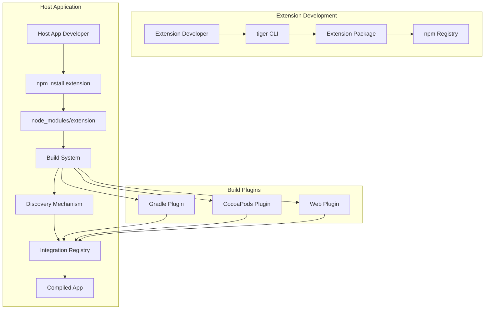

# Design Document

## Overview

This design outlines the migration of the tiger CLI from fragile file pattern matching to a robust Autolink mechanism. The solution introduces automatic discovery and integration of LynxJS native extensions through build system plugins, standardized package formats, and generated integration registries.

The architecture follows the proven React Native autolinking approach but adapts it specifically for LynxJS's module system and build requirements.

## Architecture

### High-Level Architecture



### Core Components

1. **Enhanced CLI Tool**: Extended tiger with Autolink support
2. **Discovery Engine**: Scans node_modules for extension packages
3. **Build System Plugins**: Platform-specific integration handlers
4. **Registry Generator**: Creates platform-specific registration code
5. **Configuration Parser**: Handles tiger.config.json metadata

## Components and Interfaces

### 1. Enhanced CLI Tool

**Purpose**: Extends existing tiger CLI with Autolink capabilities

**Key Interfaces**:

```typescript
interface AutolinkConfig {
  packageName: string;
  platforms: {
    android?: AndroidConfig;
    ios?: IOSConfig;
    web?: WebConfig;
  };
  dependencies?: string[];
  version: string;
}

interface AndroidConfig {
  packageName: string;
  sourceDir?: string;
  buildTypes?: string[];
}

interface IOSConfig {
  podspecPath?: string;
  sourceDir?: string;
  frameworks?: string[];
}
```

**Commands**:

- `tiger init --autolink` - Create Autolink-compatible extension
- `tiger migrate` - Convert legacy modules to Autolink format
- `tiger validate` - Verify extension package structure

### 2. Discovery Engine

**Purpose**: Automatically finds and catalogs extension packages

**Core Algorithm**:

```typescript
class ExtensionDiscovery {
  async discoverExtensions(projectRoot: string): Promise<ExtensionInfo[]> {
    // 1. Scan node_modules for packages with tiger.config.json
    // 2. Parse configuration files
    // 3. Validate platform support
    // 4. Build dependency graph
    // 5. Return sorted extension list
  }

  validateExtension(extensionPath: string): ValidationResult {
    // Validate package structure and configuration
  }
}
```

**Discovery Process**:

1. Scan `node_modules` for `tiger.config.json` files
2. Parse configuration and validate structure
3. Check platform compatibility
4. Resolve inter-extension dependencies
5. Generate integration manifest

### 3. Build System Plugins

#### Android Gradle Plugin

**Integration Points**:

- `settings.gradle.kts` - Extension discovery
- `build.gradle.kts` - Dependency injection
- Build lifecycle hooks for code generation

**Generated Files**:

```kotlin
// Generated: android/src/main/java/com/app/extensions/ExtensionRegistry.kt
object ExtensionRegistry {
    fun setupGlobal(context: Context) {
        // Register all discovered extensions
        NativeModuleRegistry.register("LocalStorage", LocalStorageModule::class.java)
        ElementRegistry.register("custom-button", CustomButton::class.java)
    }
}
```

#### iOS CocoaPods Plugin

**Integration Points**:

- `Podfile` - Automatic pod inclusion
- Build phases for code generation
- Header search path management

**Generated Files**:

```objc
// Generated: ios/ExtensionRegistry.h
@interface ExtensionRegistry : NSObject
+ (void)setupWithConfig:(LynxConfig *)config;
@end

// Generated: ios/ExtensionRegistry.m
@implementation ExtensionRegistry
+ (void)setupWithConfig:(LynxConfig *)config {
    // Register all discovered extensions
}
@end
```

#### Web Plugin

**Integration Points**:

- Webpack/Vite plugin for module bundling
- Dynamic import generation
- TypeScript declaration merging

### 4. Registry Generator

**Purpose**: Creates platform-specific registration code

**Generation Strategy**:

```typescript
class RegistryGenerator {
  generateAndroidRegistry(extensions: ExtensionInfo[]): string {
    // Generate Kotlin registration code
  }

  generateIOSRegistry(extensions: ExtensionInfo[]): string {
    // Generate Objective-C registration code
  }

  generateWebRegistry(extensions: ExtensionInfo[]): string {
    // Generate TypeScript registration code
  }
}
```

### 5. Configuration System

**tiger.config.json Structure**:

```json
{
  "name": "@lynxjs/local-storage",
  "version": "1.0.0",
  "lynxVersion": ">=0.70.0",
  "platforms": {
    "android": {
      "packageName": "com.lynxjs.localstorage",
      "sourceDir": "android/src/main",
      "buildTypes": ["debug", "release"]
    },
    "ios": {
      "podspecPath": "ios/LocalStorage.podspec",
      "sourceDir": "ios/src",
      "frameworks": ["Foundation"]
    },
    "web": {
      "entry": "web/src/index.ts"
    }
  },
  "dependencies": [],
  "nativeModules": ["LocalStorageModule"],
  "elements": ["LocalStorageButton"],
  "services": []
}
```

## Data Models

### Extension Package Structure

```
@lynxjs/extension-name/
├── tiger.config.json              # Autolink configuration
├── package.json               # npm package metadata
├── src/                       # TypeScript source
│   ├── index.ts              # Main export
│   └── module.ts             # Interface definitions
├── android/                   # Android implementation
│   ├── build.gradle.kts      # Android build config
│   └── src/main/kotlin/      # Kotlin source files
├── ios/                       # iOS implementation
│   ├── Extension.podspec     # CocoaPods spec
│   └── src/                  # Swift/Objective-C source
├── web/                       # Web implementation
│   └── src/                  # Web-specific code
└── generated/                 # Generated platform code
    ├── android/              # Generated Kotlin
    ├── ios/                  # Generated Swift/ObjC
    └── typescript/           # Generated .d.ts files
```

### Extension Registry Data Model

```typescript
interface ExtensionInfo {
  name: string;
  version: string;
  path: string;
  config: AutolinkConfig;
  platforms: Platform[];
  dependencies: string[];
  nativeModules: ModuleInfo[];
  elements: ElementInfo[];
  services: ServiceInfo[];
}

interface ModuleInfo {
  name: string;
  className: string;
  platform: Platform;
  sourceFile: string;
}
```

## Error Handling

### Discovery Errors

- **Missing Configuration**: Clear error when tiger.config.json is missing or malformed
- **Platform Mismatch**: Warning when extension doesn't support current platform
- **Dependency Conflicts**: Resolution guidance for conflicting extension versions
- **Invalid Structure**: Detailed validation errors with fix suggestions

### Build Integration Errors

- **Plugin Installation**: Step-by-step guidance for build plugin setup
- **Code Generation**: Clear errors when generated code fails to compile
- **Registry Conflicts**: Automatic resolution or clear conflict reporting
- **Platform Compatibility**: Runtime checks for platform support

### Migration Errors

- **Legacy Format**: Detailed migration steps for unsupported legacy formats
- **Partial Migration**: Support for mixed legacy/autolink environments
- **Configuration Conversion**: Automatic conversion with manual review options

## Testing Strategy

### Unit Testing

- **Discovery Engine**: Test extension scanning and validation logic
- **Registry Generator**: Verify generated code correctness for all platforms
- **Configuration Parser**: Test tiger.config.json parsing and validation
- **CLI Commands**: Test all new CLI functionality with mocked file systems

### Integration Testing

- **Build Plugin Integration**: Test with real Gradle/CocoaPods projects
- **End-to-End Workflows**: Full extension creation, installation, and usage
- **Platform Compatibility**: Test on multiple Android/iOS project configurations
- **Migration Scenarios**: Test legacy to autolink migration paths

### Performance Testing

- **Discovery Performance**: Measure extension scanning time with large node_modules
- **Build Time Impact**: Ensure minimal overhead in build process
- **Registry Size**: Monitor generated code size and runtime performance

### Compatibility Testing

- **LynxJS Versions**: Test with multiple LynxJS framework versions
- **Build Tools**: Verify compatibility with different Gradle/Xcode versions
- **Node.js Versions**: Ensure CLI works across supported Node.js versions
- **Package Managers**: Test with npm, yarn, and pnpm

## Migration Strategy

### Phase 1: Core Infrastructure

1. Implement discovery engine and configuration parser
2. Create basic build system plugins
3. Add autolink support to CLI tool
4. Establish testing framework

### Phase 2: Platform Integration

1. Complete Android Gradle plugin
2. Complete iOS CocoaPods plugin
3. Implement web bundler integration
4. Add registry generation

### Phase 3: Migration Support

1. Add legacy format detection
2. Implement migration commands
3. Create compatibility layer
4. Add validation and error handling

### Phase 4: Documentation and Adoption

1. Create migration guides
2. Update CLI documentation
3. Provide example extensions
4. Support community adoption
