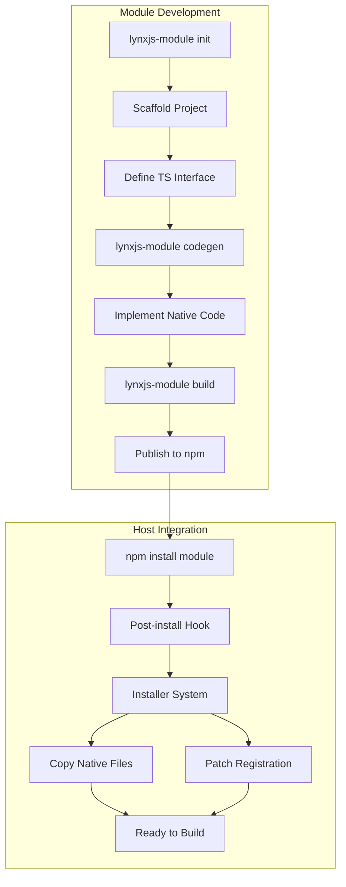
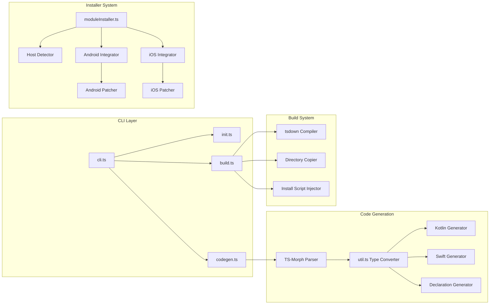

# Design Document

## Overview

The lynxjs-module system consists of three main components:

1. **CLI System** - Command-line interface providing init, codegen, and build commands
2. **Code Generation Engine** - TypeScript AST parser that generates native code from interfaces
3. **Installer System** - Post-install automation that integrates modules into host applications

The system follows a clear workflow: Module developers scaffold projects with `init`, define TypeScript interfaces, generate native code with `codegen`, implement native functionality, and build distributable packages with `build`. When host developers install the module via npm, the post-install script automatically copies native files and registers the module with the LynxJS runtime.

## Architecture

### High-Level Architecture



### Component Architecture



## Components and Interfaces

### 1. CLI System (cli.ts)

**Responsibility:** Entry point for all commands, argument parsing, and command routing

**Interface:**
```typescript
interface CLICommand {
  name: string;
  description: string;
  action: (args: any) => Promise<void>;
}

// Commands
- init [moduleName]: Scaffold new module
- codegen: Generate native code from TS
- build: Build distributable package
```

**Dependencies:**
- commander: Command-line argument parsing
- init.ts, codegen.ts, build.ts: Command implementations

### 2. Init Command (init.ts)

**Status:** ✅ Current implementation is correct - no changes needed

**Responsibility:** Scaffold new module projects with proper structure and configuration

**Note:** The existing init.ts implementation correctly follows LynxJS guidelines. Only minor tweak needed:

**tsdown.config.ts Update:**
```typescript
import { defineConfig } from 'tsdown'

export default defineConfig([
  {
    entry: {
      index: "./src/index.ts",
      config: './module.config.ts'  // Add config to entry points
    },
    platform: 'neutral',
    dts: true,
  },
])
```

This ensures module.config.ts is compiled to dist/ for the installer to read.

### 3. Codegen Command (codegen.ts)

**Status:** ✅ Current implementation is correct - no changes needed

**Responsibility:** Parse TypeScript interfaces and generate native code for Android and iOS

**Note:** The existing codegen.ts and util.ts implementations correctly follow LynxJS type mapping guidelines. The type conversion strategy is already optimal:
- Callbacks: Kotlin → Callback, Swift → (Any) -> Void
- Arrays: Kotlin → ReadableArray, Swift → NSArray
- Objects: Kotlin → ReadableMap, Swift → NSDictionary
- Primitives: Direct mapping (string → String, number → Double, etc.)

### 4. Build Command (build.ts)

**Status:** 🔧 Needs improvements for robust distribution

**Responsibility:** Compile TypeScript, bundle native files, and prepare for distribution

**Interface:**
```typescript
export default async function buildModule(): Promise<void>

async function copyDir(src: string, dest: string): Promise<void>
async function writeDistInstall(distDir: string): Promise<void>
async function writeDistPackageJson(moduleDir: string, distDir: string): Promise<void>
async function copyModuleConfig(moduleDir: string, distDir: string): Promise<void>
```

**Improved Key Operations:**
1. Execute tsdown to compile TypeScript → JavaScript (includes module.config.ts → dist/config.js)
2. Copy android/ directory to dist/android/ (preserve full structure)
3. Copy ios/ directory to dist/ios/ (preserve full structure)
4. Copy {ModuleName}Module.d.ts to dist/ (type declarations)
5. Generate dist/install.js that imports moduleInstaller
6. Modify dist/package.json to add postinstall script
7. Ensure dist/package.json files array includes android, ios, dist, and *.d.ts

**Improvements Over Current Implementation:**

1. **Module Config Availability:**
   - tsdown now compiles module.config.ts to dist/config.js
   - Installer can reliably import from dist/config.js
   - No need for regex parsing of .ts files

2. **Type Declaration Handling:**
   - Copy generated .d.ts files to dist/
   - Ensures consumers get proper TypeScript types
   - Include in package.json exports

3. **Robust Directory Copying:**
   - Verify source directories exist before copying
   - Log detailed copy operations
   - Handle symlinks and special files gracefully

4. **Package.json Preparation:**
   - Create clean dist/package.json (not modify original)
   - Set correct main/module/types paths
   - Ensure exports map includes all entry points

**dist/install.js Content:**
```javascript
import install from 'lynxjs-module/install';
const moduleDir = process.cwd();
console.log("Starting lynx module installer...");
console.log("Current module directory:", moduleDir);
install({ moduleDir }).catch((err) => {
  console.error('lynx module installer failed:', err);
  process.exit(1);
});
```

**dist/package.json Structure:**
```json
{
  "name": "module-name",
  "version": "0.1.0",
  "main": "./index.js",
  "module": "./index.js",
  "types": "./index.d.ts",
  "exports": {
    ".": {
      "types": "./index.d.ts",
      "import": "./index.js",
      "require": "./index.js"
    },
    "./types": {
      "types": "./ModuleNameModule.d.ts"
    }
  },
  "scripts": {
    "postinstall": "node ./install.js"
  },
  "files": ["android", "ios", "*.js", "*.d.ts", "config.js"]
}
```

### 5. Installer System (moduleInstaller.ts)

**Status:** 🔧 Needs significant improvements for reliability and iOS support

**Responsibility:** Automatically integrate module into host application during npm install

**Interface:**
```typescript
export default async function install(opts: { moduleDir?: string }): Promise<void>

interface ModuleConfig {
  moduleName: string;
  androidPackageName?: string;
  description?: string;
  moduleFile?: string;
}

// Internal functions
async function readModuleConfig(moduleDir: string): Promise<ModuleConfig | null>
function findHostRoot(moduleDir: string): string
async function copyAndroidSources(moduleDir: string, hostRoot: string, androidPackageName?: string): Promise<void>
async function patchAndroidRegistration(hostRoot: string, moduleCfg: ModuleConfig): Promise<void>
async function copyIOSSources(moduleDir: string, hostRoot: string, moduleName: string): Promise<void>
async function patchIOSRegistration(hostRoot: string, moduleCfg: ModuleConfig): Promise<void>
async function patchBridgingHeader(hostRoot: string, moduleCfg: ModuleConfig): Promise<void>
async function patchSwiftRegister(hostRoot: string, moduleCfg: ModuleConfig): Promise<void>
async function patchObjectiveCRegister(hostRoot: string, moduleCfg: ModuleConfig): Promise<void>
```

**Improved Key Operations:**

#### Host Detection (Current - Works Well)
1. Parse moduleDir path to find node_modules
2. Extract host root as parent of node_modules
3. Fallback: Use ../../ relative to moduleDir

#### Config Loading (Improved)
1. Try importing dist/config.js (compiled by tsdown) - **PRIMARY METHOD**
2. Try dynamic import of module.config.js
3. Fallback to package.json name field
4. No more regex parsing of .ts files (unreliable)

**Improved Implementation:**
```typescript
async function readModuleConfig(moduleDir: string): Promise<ModuleConfig | null> {
  // Try compiled config first (most reliable)
  const distConfig = path.join(moduleDir, "dist", "config.js");
  if (await fileExists(distConfig)) {
    const { config } = await import(distConfig);
    return config;
  }
  
  // Try root config.js
  const rootConfig = path.join(moduleDir, "module.config.js");
  if (await fileExists(rootConfig)) {
    const { config } = await import(rootConfig);
    return config;
  }
  
  // Fallback to package.json
  const pkgPath = path.join(moduleDir, "package.json");
  if (await fileExists(pkgPath)) {
    const pkg = JSON.parse(await fs.promises.readFile(pkgPath, "utf8"));
    return { moduleName: pkg.name || "UnnamedModule" };
  }
  
  return null;
}
```

#### Android Integration (Current - Works Well)
1. Use fast-glob to find .kt/.java files matching package structure
2. Search patterns:
   - `{moduleDir}/android/**/src/**/java/**/{packagePath}/**/*.{kt,java}`
   - `{moduleDir}/dist/android/**/src/**/java/**/{packagePath}/**/*.{kt,java}`
3. Find host Java roots: `**/android/**/src/**/main/**/java`
4. Copy files to host, preserving package structure
5. Skip if content identical (idempotency)

#### Android Registration Patching (Current - Works Well)
1. Search host for files containing "LynxEnv.inst()"
2. Detect file type (.kt vs .java)
3. Add import: `import {package}.{ModuleName}Module`
4. Insert registration after LynxEnv.inst():
   - Kotlin: `LynxEnv.inst().registerModule("{ModuleName}Module", {ModuleName}Module::class);`
   - Java: `LynxEnv.inst().registerModule("{ModuleName}Module", {ModuleName}Module.class);`
5. Check for existing registration to avoid duplicates

#### iOS Integration (Needs Implementation)

**Current Issue:** No copyIOSSources function exists

**New Implementation Needed:**
```typescript
async function copyIOSSources(
  moduleDir: string,
  hostRoot: string,
  moduleName: string
): Promise<void> {
  const searchRoot = moduleDir.replace(/\\/g, "/");
  const patterns = [
    `${searchRoot}/ios/modules/**/*.{swift,m,h}`,
    `${searchRoot}/dist/ios/modules/**/*.{swift,m,h}`
  ];
  
  const found = await fg(patterns, {
    dot: true,
    onlyFiles: true,
    unique: true,
    absolute: true
  });
  
  console.log("module iOS source search patterns:", patterns);
  console.log("found iOS source files:", found.length);
  
  if (found.length === 0) return;
  
  // Find host iOS/apple directories
  const hostIOSRoots = await fg(
    ["**/ios/**", "**/apple/**"],
    { 
      cwd: hostRoot, 
      onlyDirectories: true, 
      unique: true, 
      absolute: true,
      ignore: ["**/node_modules/**"]
    }
  );
  
  console.log("host iOS roots found:", hostIOSRoots.length);
  if (hostIOSRoots.length === 0) return;
  
  // Copy to first matching iOS root's modules directory
  const hostIOSRoot = hostIOSRoots[0];
  const modulesDir = path.join(hostIOSRoot, "modules");
  
  for (const srcFile of found) {
    const fileName = path.basename(srcFile);
    const dstFile = path.join(modulesDir, fileName);
    const changed = await copyFileIfDifferent(srcFile, dstFile);
    if (changed) console.log("copied", srcFile, "->", dstFile);
  }
}
```

#### iOS Registration Patching (Needs Major Improvements)

**Current Issues:**
1. patchBridgingHeader only handles Objective-C projects
2. patchSwiftRegister looks for placeholder comments (unreliable)
3. No handling of Objective-C .m files with registerModule

**Improved Strategy:**

**For Swift Projects:**
```typescript
async function patchSwiftRegister(
  hostRoot: string,
  moduleCfg: ModuleConfig
): Promise<void> {
  const moduleName = moduleCfg.moduleName;
  if (!moduleName) return;
  
  // Find Swift files that likely contain LynxModule setup
  const swiftFiles = await fg(
    ["**/AppDelegate.swift", "**/SceneDelegate.swift", "**/*Application*.swift"],
    {
      cwd: hostRoot,
      absolute: true,
      ignore: ["**/node_modules/**"]
    }
  );
  
  for (const file of swiftFiles) {
    let content = await fs.promises.readFile(file, "utf8");
    
    // Look for existing registerModule or config.register patterns
    if (content.includes("registerModule") || content.includes("config.register")) {
      const regLine = `        config.register(${moduleName}Module.self)`;
      
      // Check if already registered
      if (content.includes(`${moduleName}Module.self`)) {
        console.log("module already registered in", file);
        continue;
      }
      
      // Find the last registerModule call and add after it
      const lines = content.split('\n');
      let insertIndex = -1;
      
      for (let i = lines.length - 1; i >= 0; i--) {
        if (lines[i].includes('registerModule') || lines[i].includes('config.register')) {
          insertIndex = i + 1;
          break;
        }
      }
      
      if (insertIndex > 0) {
        lines.splice(insertIndex, 0, regLine);
        const newContent = lines.join('\n');
        await fs.promises.writeFile(file, newContent, "utf8");
        console.log("patched Swift file", file, "to register", moduleName);
      }
    }
  }
}
```

**For Objective-C Projects:**
```typescript
async function patchObjectiveCRegister(
  hostRoot: string,
  moduleCfg: ModuleConfig
): Promise<void> {
  const moduleName = moduleCfg.moduleName;
  if (!moduleName) return;
  
  // Find .m files that contain registerModule
  const objcFiles = await fg(
    ["**/*.m"],
    {
      cwd: hostRoot,
      absolute: true,
      ignore: ["**/node_modules/**"]
    }
  );
  
  for (const file of objcFiles) {
    let content = await fs.promises.readFile(file, "utf8");
    
    if (!content.includes("registerModule")) continue;
    
    // Check if already registered
    if (content.includes(`${moduleName}Module`)) {
      console.log("module already registered in", file);
      continue;
    }
    
    // Determine if using Swift bridging header
    const hasSwiftBridge = content.includes("-Swift.h");
    
    // Add import
    let importLine;
    if (hasSwiftBridge) {
      // Swift module, no import needed (already in bridging header)
      importLine = null;
    } else {
      // Objective-C module
      importLine = `#import "${moduleName}Module.h"`;
    }
    
    if (importLine && !content.includes(importLine)) {
      content = content.replace(
        /(#import.*\n)+/,
        `$&${importLine}\n`
      );
    }
    
    // Add registration
    const regLine = `    [globalConfig registerModule:${moduleName}Module.class];`;
    
    if (!content.includes(regLine)) {
      content = content.replace(
        /(\[globalConfig registerModule:[^\]]+\];)/,
        `$1\n${regLine}`
      );
      
      await fs.promises.writeFile(file, newContent, "utf8");
      console.log("patched Objective-C file", file, "to register", moduleName);
    }
  }
}
```

**Bridging Header Patching (Improved):**
```typescript
async function patchBridgingHeader(
  hostRoot: string,
  moduleCfg: ModuleConfig
): Promise<void> {
  const moduleName = moduleCfg.moduleName;
  if (!moduleName) return;
  
  const patterns = ["**/*-Bridging-Header.h", "**/Bridging-Header.h"];
  const headers = await fg(patterns, {
    cwd: hostRoot,
    absolute: true,
    ignore: ["**/node_modules/**"]
  });
  
  if (headers.length === 0) {
    console.log("no bridging header found, skipping");
    return;
  }
  
  for (const h of headers) {
    let content = await fs.promises.readFile(h, "utf8");
    let modified = false;
    
    // Add Lynx import if missing
    if (!content.includes("#import <Lynx/LynxModule.h>")) {
      content = `#import <Lynx/LynxModule.h>\n` + content;
      modified = true;
    }
    
    // For Swift modules, no .h import needed
    // For Objective-C modules, add .h import
    // Since codegen creates .swift files, we don't need .h import
    
    if (modified) {
      await fs.promises.writeFile(h, content, "utf8");
      console.log("patched bridging header", h);
    }
  }
}
```

**Unified iOS Registration Function:**
```typescript
async function patchIOSRegistration(
  hostRoot: string,
  moduleCfg: ModuleConfig
): Promise<void> {
  // Try Swift registration
  await patchSwiftRegister(hostRoot, moduleCfg);
  
  // Try Objective-C registration
  await patchObjectiveCRegister(hostRoot, moduleCfg);
  
  // Update bridging header if needed
  await patchBridgingHeader(hostRoot, moduleCfg);
}
```

## Data Models

### ModuleConfig
```typescript
interface ModuleConfig {
  moduleName: string;           // PascalCase name (e.g., "LocalStorage")
  androidPackageName: string;   // Java package (e.g., "com.modules.localstorage")
  description: string;          // Human-readable description
  moduleFile: string;           // Path to module.ts (default: "./src/module.ts")
}
```

### ParsedMethod
```typescript
interface ParsedMethod {
  name: string;                 // Method name
  params: ParsedParameter[];    // Method parameters
  returnType: string;           // TypeScript return type
}
```

### ParsedParameter
```typescript
interface ParsedParameter {
  paramName: string;            // Parameter name
  isOptional: boolean;          // Whether parameter is optional
  typeText: string;             // TypeScript type as string
}
```

### FileSearchResult
```typescript
interface FileSearchResult {
  absolutePath: string;         // Absolute file path
  relativePath: string;         // Path relative to search root
  packagePath?: string;         // Java/Kotlin package path
}
```

## Error Handling

### CLI Errors

**Invalid Module Name:**
- Detection: Regex check for PascalCase
- Response: Display error message, exit with code 1
- Message: "Module name must be PascalCase (e.g. LocalStorage)"

**Missing Config:**
- Detection: module.config.ts/js not found
- Response: Log warning with searched paths, abort operation
- Message: "module.config.ts or module.config.js not found in current working directory"

**Codegen Parse Failure:**
- Detection: No interface extending MyModuleGenerator
- Response: Throw error with descriptive message
- Message: "No interface extending MyModuleGenerator found in {file}"

**Build Failure:**
- Detection: tsdown exit code !== 0
- Response: Throw error, propagate to caller
- Message: "tsdown failed"

### Installer Errors

**Config Read Failure:**
- Detection: All config file attempts fail
- Response: Log warning, abort installation gracefully
- Message: "could not read module config; aborting installer"

**No Host Directories Found:**
- Detection: fast-glob returns empty array
- Response: Log warning, continue (module may not need that platform)
- Message: "host android java roots found: 0" or "host iOS roots found: 0"

**File Copy Failure:**
- Detection: fs.promises.copyFile throws
- Response: Log warning, continue with other files
- Message: "copy android/ios failed: {error}"

**Patch Failure:**
- Detection: Regex replacement doesn't match
- Response: Log warning, continue (manual integration may be needed)
- Message: "could not patch {file} for registration"

### Error Recovery Strategy

1. **Graceful Degradation:** If one platform fails, continue with others
2. **Idempotency:** Always check before modifying to allow retries
3. **Verbose Logging:** Log all operations for debugging
4. **Non-Blocking Warnings:** Warn but don't fail for optional operations
5. **Clear Exit Codes:** Use process.exit(1) for fatal errors

## Testing Strategy

### Unit Tests

**Build Command:**
- Test tsdown execution and error handling
- Test directory copying with nested structures
- Test dist/install.js generation
- Test dist/package.json creation with correct fields
- Test handling of missing android/ios directories
- Mock file system operations

**Config Loading (Installer):**
- Test loading compiled dist/config.js
- Test loading module.config.js
- Test fallback to package.json
- Test missing config handling
- Test malformed config handling

**iOS File Copying:**
- Test copyIOSSources with various file structures
- Test finding host iOS/apple directories
- Test copying to modules/ subdirectory
- Test idempotency (skip identical files)

**iOS Registration Patching:**
- Test patchSwiftRegister with various Swift file structures
- Test patchObjectiveCRegister with .m files
- Test finding registerModule patterns
- Test avoiding duplicate registrations
- Test bridging header updates

**File Operations:**
- Test copyDir with nested structures
- Test copyFileIfDifferent with identical files
- Test copyFileIfDifferent with different files
- Test directory creation with recursive option

### Integration Tests

**Build Process:**
1. Create mock module with android/ios directories
2. Run build command
3. Verify dist/ contains compiled JS
4. Verify dist/android/ copied correctly
5. Verify dist/ios/ copied correctly
6. Verify dist/install.js exists and is valid
7. Verify dist/package.json has postinstall script
8. Verify dist/config.js exists (compiled from module.config.ts)

**Installer Integration - Android:**
1. Create mock Android Kotlin host project
2. Create mock module in node_modules with dist/
3. Run installer
4. Verify Kotlin files copied to correct package path
5. Verify import added to Application file
6. Verify registerModule call added
7. Run installer again (idempotency test)
8. Verify no duplicate imports or registrations

**Installer Integration - iOS Swift:**
1. Create mock iOS Swift host project
2. Create mock module in node_modules with dist/
3. Run installer
4. Verify Swift files copied to modules/ directory
5. Verify config.register call added to AppDelegate
6. Run installer again (idempotency test)
7. Verify no duplicate registrations

**Installer Integration - iOS Objective-C:**
1. Create mock iOS Objective-C host project with bridging header
2. Create mock module in node_modules with dist/
3. Run installer
4. Verify Swift files copied to modules/ directory
5. Verify bridging header updated
6. Verify registerModule call added to .m file
7. Run installer again (idempotency test)
8. Verify no duplicate imports or registrations

**Platform-Specific Tests:**
- Test Android Kotlin project integration
- Test Android Java project integration
- Test iOS Swift project integration
- Test iOS Objective-C project integration
- Test mixed Swift/Objective-C projects
- Test projects with multiple Application files
- Test projects with non-standard directory structures

### Test Fixtures

**Mock Module Structure (After Build):**
```
module-name/
├── dist/
│   ├── index.js
│   ├── index.d.ts
│   ├── config.js          # Compiled module.config
│   ├── ModuleNameModule.d.ts
│   ├── install.js
│   ├── package.json       # With postinstall
│   ├── android/
│   │   └── src/main/java/com/modules/modulename/
│   │       └── ModuleNameModule.kt
│   └── ios/
│       └── modules/
│           └── ModuleNameModule.swift
```

**Mock Host Projects:**

**Android Kotlin:**
```kotlin
// app/src/main/java/com/myapp/MainApplication.kt
package com.myapp

import com.lynx.LynxEnv

class MainApplication : Application() {
    override fun onCreate() {
        super.onCreate()
        LynxEnv.inst().init(this)
        // Modules will be registered here
    }
}
```

**iOS Swift:**
```swift
// ios/MyApp/AppDelegate.swift
import UIKit
import Lynx

@main
class AppDelegate: UIResponder, UIApplicationDelegate {
    func application(_ application: UIApplication, ...) -> Bool {
        let config = LynxConfig()
        // Modules will be registered here
        config.register(SomeExistingModule.self)
        return true
    }
}
```

**iOS Objective-C:**
```objc
// ios/MyApp/AppDelegate.m
#import "AppDelegate.h"
#import "MyApp-Swift.h"

@implementation AppDelegate

- (void)setupLynxEnv {
    LynxConfig *globalConfig = [LynxConfig new];
    // Modules will be registered here
    [globalConfig registerModule:SomeExistingModule.class];
}

@end
```

### Test Coverage Goals

- Unit test coverage: >80%
- Integration test coverage: >70%
- Critical paths (build, installer): 100%
- Error handling paths: >90%
- iOS registration patching: 100% (new code)

### Manual Testing Checklist

**Module Development Flow:**
- [ ] Create new module with init
- [ ] Verify tsdown.config.ts includes config entry
- [ ] Add methods to interface
- [ ] Run codegen, verify native files
- [ ] Implement native functionality in Kotlin
- [ ] Implement native functionality in Swift
- [ ] Run build, verify dist/ structure
- [ ] Verify dist/config.js exists
- [ ] Verify dist/android/ copied
- [ ] Verify dist/ios/ copied
- [ ] Verify dist/install.js exists
- [ ] Verify dist/package.json has postinstall

**Host Integration - Android:**
- [ ] Create test Android Kotlin app
- [ ] Install module via npm
- [ ] Verify Kotlin files in correct package
- [ ] Verify import added to Application
- [ ] Verify registerModule call added
- [ ] Build Android app successfully
- [ ] Run npm install again
- [ ] Verify no duplicates

**Host Integration - iOS Swift:**
- [ ] Create test iOS Swift app
- [ ] Install module via npm
- [ ] Verify Swift files in modules/
- [ ] Verify config.register call added
- [ ] Build iOS app successfully
- [ ] Run npm install again
- [ ] Verify no duplicates

**Host Integration - iOS Objective-C:**
- [ ] Create test iOS Objective-C app with bridging header
- [ ] Install module via npm
- [ ] Verify Swift files in modules/
- [ ] Verify bridging header updated
- [ ] Verify registerModule call added to .m
- [ ] Build iOS app successfully
- [ ] Run npm install again
- [ ] Verify no duplicates

**Runtime Testing:**
- [ ] Test module functionality on Android device
- [ ] Test module functionality on iOS device
- [ ] Verify module methods callable from JavaScript
- [ ] Verify callbacks work correctly
- [ ] Verify error handling

## Implementation Notes

### Fast-Glob Patterns

**Android Source Files:**
```typescript
const patterns = [
  `${moduleDir}/android/**/src/**/java/**/${packagePath}/**/*.{kt,java}`,
  `${moduleDir}/dist/android/**/src/**/java/**/${packagePath}/**/*.{kt,java}`
];
```

**iOS Source Files:**
```typescript
const patterns = [
  `${moduleDir}/ios/modules/**/*.{swift,m,h}`,
  `${moduleDir}/dist/ios/modules/**/*.{swift,m,h}`
];
```

**Host Android Roots:**
```typescript
const patterns = [
  '**/android/**/src/**/main/**/java',
  '**/android/**/src/**/java'
];
```

**Host iOS Roots:**
```typescript
const patterns = [
  '**/ios/**',
  '**/apple/**'
];
```

### Regex Patterns

**Config Parsing:**
```typescript
const moduleName = /moduleName\s*[:=]\s*["']([\w-]+)["']/.exec(content)?.[1];
const androidPackageName = /androidPackageName\s*[:=]\s*["']([\w.]+)["']/.exec(content)?.[1];
```

**Android Registration Detection:**
```typescript
const hasLynxEnv = content.includes('LynxEnv.inst()');
const hasRegistration = content.includes(`registerModule("${moduleName}Module"`);
```

**Import Insertion:**
```typescript
// After package declaration
newContent = content.replace(
  /(package\s+[\w\.]+\s*)/,
  `$1\nimport ${pkg}.${className}\n`
);
```

**Registration Insertion:**
```typescript
// After LynxEnv.inst()
newContent = content.replace(
  /(LynxEnv\.inst\([\s\S]*?\)\s*\n)/,
  `$1    ${regLine}\n`
);
```

### Performance Considerations

1. **File System Operations:**
   - Use async operations (fs.promises) for I/O
   - Batch file reads where possible
   - Use fast-glob for efficient pattern matching

2. **Idempotency Checks:**
   - Compare file content before copying
   - Check for existing imports/registrations before adding
   - Use Buffer.equals() for binary comparison

3. **Glob Search Optimization:**
   - Use absolute paths to avoid path resolution overhead
   - Set unique: true to avoid duplicate results
   - Use ignore patterns to exclude node_modules

4. **Memory Management:**
   - Stream large files if needed
   - Don't load entire directory trees into memory
   - Use generators for large file lists

### Security Considerations

1. **Path Traversal:**
   - Validate all file paths before operations
   - Use path.resolve() to normalize paths
   - Reject paths containing ".." that escape project root

2. **Code Injection:**
   - Sanitize module names before using in code generation
   - Validate package names against allowed patterns
   - Escape special characters in regex patterns

3. **File Permissions:**
   - Respect existing file permissions
   - Don't modify files outside project boundaries
   - Log all file modifications for audit trail

4. **Dependency Security:**
   - Pin dependency versions in package.json
   - Regularly audit dependencies for vulnerabilities
   - Use minimal dependencies to reduce attack surface
